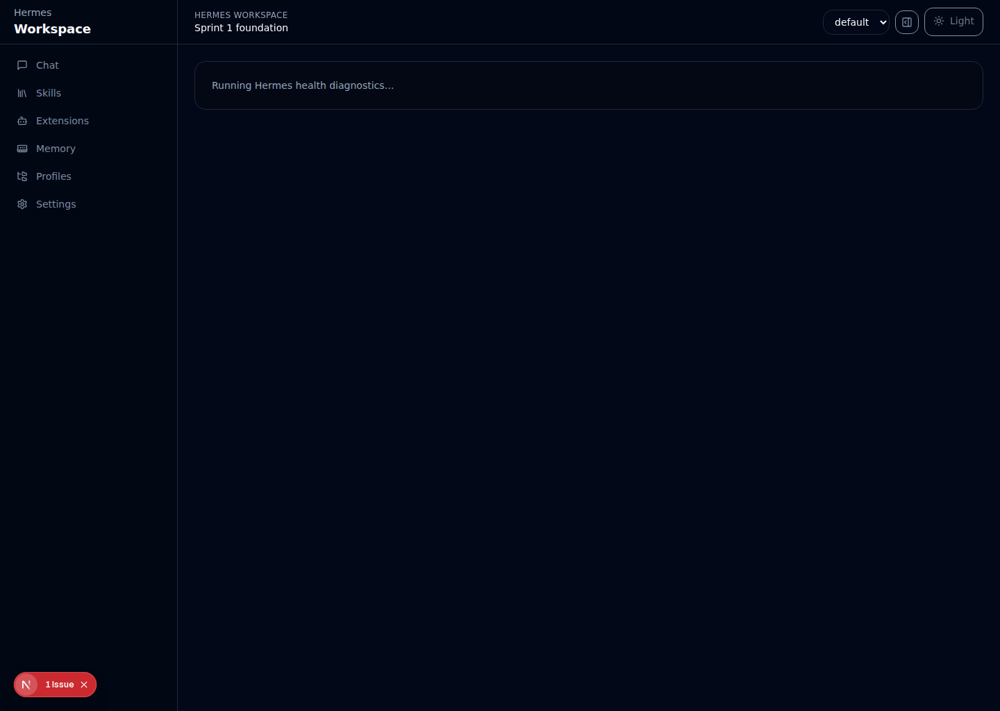
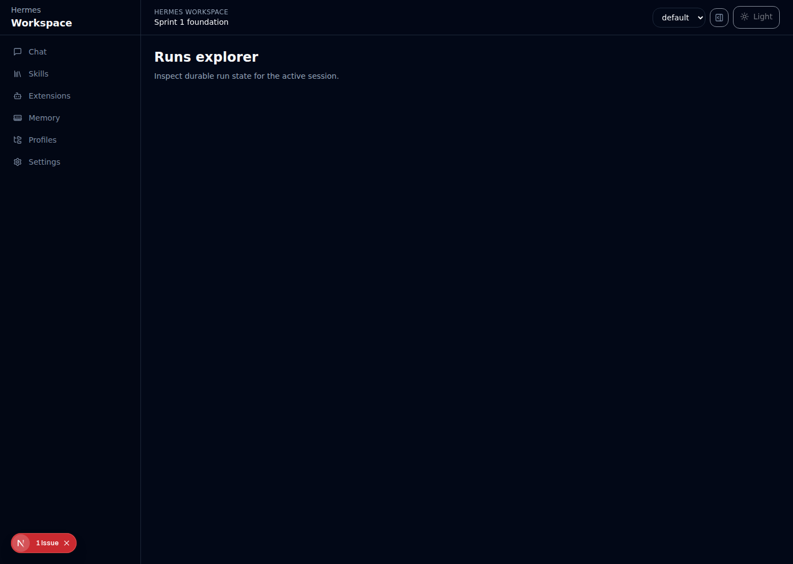

# Hermes Workspace WebUI

A first-party-style web interface for Hermes Agent with real runtime awareness, durable operational history, and admin-facing controls for sessions, skills, extensions, memory, approvals, and diagnostics.

Repo
- GitHub: https://github.com/Euraika-Labs/hermesagentwebui
- Release: https://github.com/Euraika-Labs/hermesagentwebui/releases/tag/v0.1.0-rc1

Current status
- Release-candidate quality for local/self-hosted admin usage
- Verified with lint, unit tests, build, and Playwright e2e coverage
- Public repository with protected `main`, CI, CodeQL, Dependabot, issue templates, and admin/ops docs

Why this project is interesting
- It is not just a generic chat shell — it exposes Hermes-native operational concepts
- It combines chat UX with runtime health, approvals, artifacts, run history, MCP diagnostics, and durable audit trails
- It is designed for real self-hosted admin usage rather than demo-only AI chat flows

Highlights
- Streaming Hermes chat UI with session management
- Tool timeline, approvals, artifacts, and run history
- Real Hermes-backed integration for sessions, memory, skills, extensions, and profiles
- Runtime health, MCP diagnostics, audit, telemetry, approvals, and artifacts browser pages
- Durable runtime.db, audit.db, and upload persistence
- JSON and CSV runtime exports

Tech stack
- Next.js 15
- React 18
- TypeScript
- TanStack Query
- Tailwind CSS
- Playwright + Vitest

Quick start
1. Install dependencies
   - `npm install`
2. Configure environment as needed
   - `HERMES_WORKSPACE_USERNAME`
   - `HERMES_WORKSPACE_PASSWORD`
   - `HERMES_WORKSPACE_SESSION_SECRET`
   - `HERMES_HOME`
   - `HERMES_API_BASE_URL`
   - `HERMES_API_KEY`
   - `HERMES_API_TIMEOUT_MS`
   - `HERMES_MOCK_MODE`
3. Start the app
   - `npm run dev`
4. Open the app
   - http://localhost:3000

Verification
- `npm run lint`
- `npm run test`
- `npm run build`
- `npm run test:e2e`

Screenshots

Login

Chat workspace

Runtime-aware chat

Runtime health

Runs explorer

Repository structure
- `src/app` — routes and API endpoints
- `src/features` — UI feature modules
- `src/server` — Hermes/runtime bridge, persistence, auth, and adapters
- `docs` — architecture, roadmap, deployment, and release docs
- `tests` — unit and e2e coverage

Important docs
- `docs/deployment-notes.md`
- `docs/ship-status.md`
- `docs/release-candidate-checklist.md`
- `docs/roadmap.md`
- `docs/architecture.md`

Security/admin notes
- Settings and operations pages are admin-only
- Runtime and audit history are persisted locally under `.data/`
- Some deep Hermes-core approval/resume behavior is still wrapper-based rather than fully embedded in Hermes internals

Contributing
Please read `CONTRIBUTING.md` before opening issues or pull requests.

License
MIT
