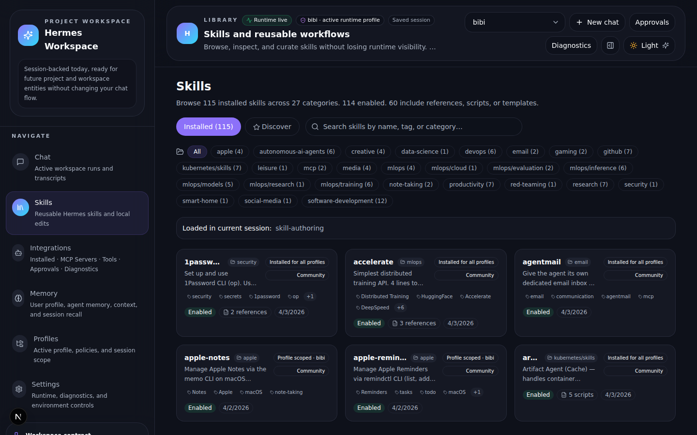
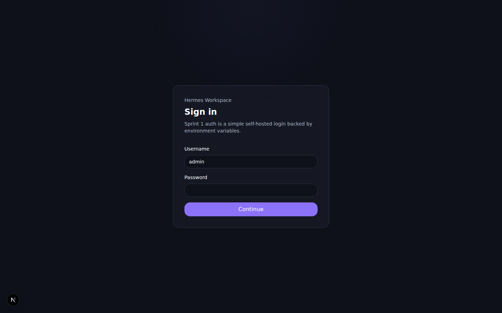
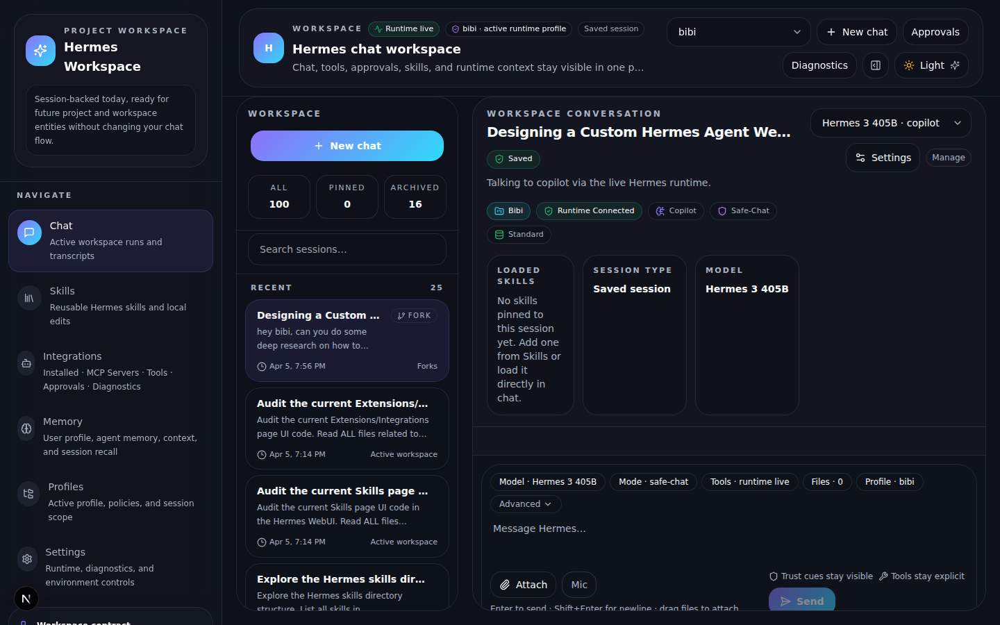
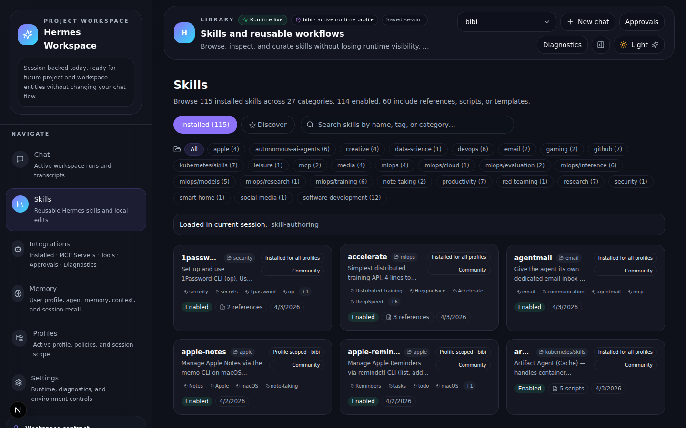
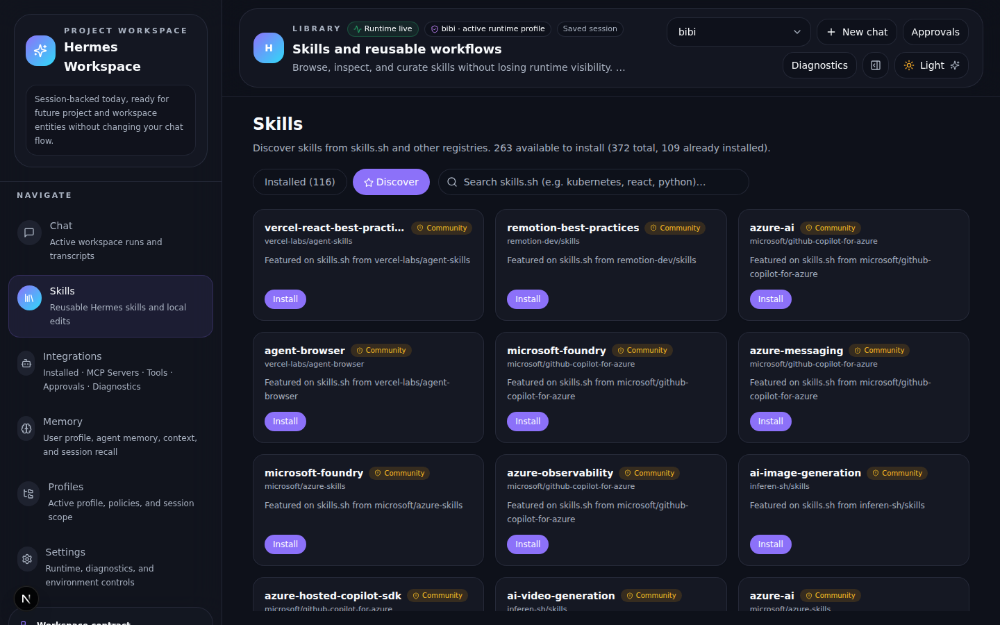
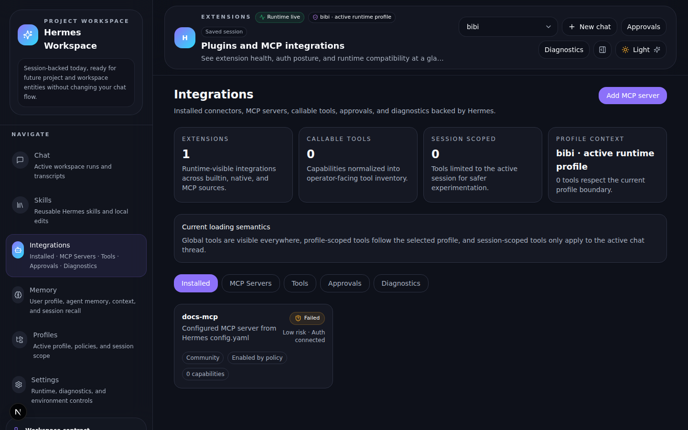
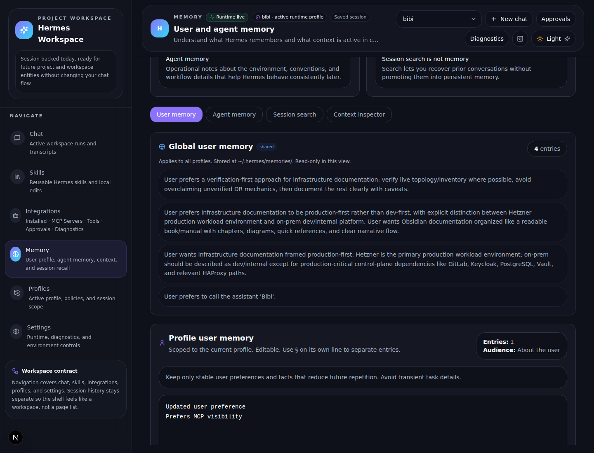
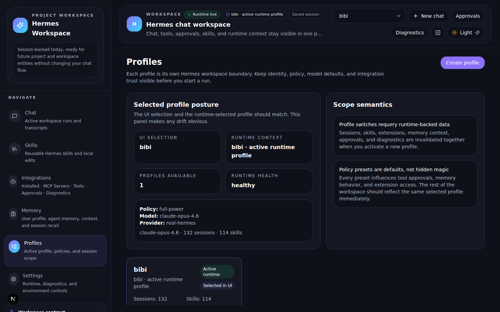
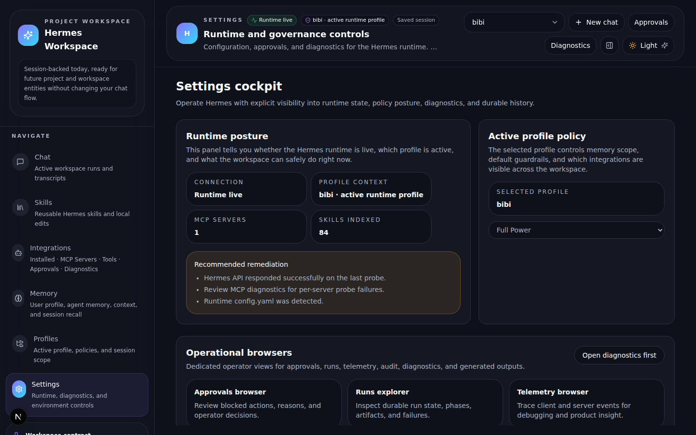

# Hermes Workspace WebUI

[](https://github.com/Euraika-Labs/hermesagentwebui/actions/workflows/ci.yml)
[](https://github.com/Euraika-Labs/hermesagentwebui/actions/workflows/codeql.yml)
[](https://github.com/Euraika-Labs/hermesagentwebui/releases)
[](./LICENSE)

A self-hosted web interface for [Hermes Agent](https://github.com/NousResearch/hermes-agent) — the AI agent by Nous Research. Chat with Hermes, manage skills from the skills.sh marketplace, control extensions and MCP integrations, inspect memory, and operate profiles — all from a single dashboard with live runtime awareness.



## Why Hermes Workspace

This is not a generic chat wrapper. Hermes Workspace exposes the full operational surface of a running Hermes Agent instance:

- **Chat with streaming** — SSE-based streaming connected to a real Hermes runtime, with tool timelines, approval cards, and artifact rendering
- **Skills marketplace** — Browse 112+ installed skills across 27 categories, discover and install 268+ more from [skills.sh](https://skills.sh) with one click
- **MCP integrations** — View installed MCP servers, their tools, health status, and diagnostics
- **Persistent memory** — Inspect and edit both global (shared) and profile-scoped user/agent memory, with proper `§`-separated entry parsing
- **Profile isolation** — Each profile is a full workspace boundary with its own sessions, skills, memory, API keys, and policy presets
- **Runtime operations** — Approvals, run history, audit trails, telemetry, runtime health, and JSON/CSV exports

## Screenshots

### Login



### Chat

Streaming chat connected to a live Hermes runtime. Session sidebar with search, pinning, and archiving. Tool timelines expand inline. Composer shows active model, mode, tools, and profile.




### Skills — Installed

112 installed skills across 27 categories. Search by name, tag, or category. Each card shows source, tags, linked files count, and whether it's loaded in the current session.



### Skills — Discover

Browse and install skills from the skills.sh hub. Trust badges (Trusted / Official / Community), install counts, security audit results, and direct links to repos.



### Extensions & MCP

Installed MCP servers with tool inventories, health badges, and capability toggles. Test connections and view diagnostics.



### Memory

Global memory (shared across profiles) displayed as read-only cards with a blue "shared" badge. Profile-scoped memory is editable. Entries are separated by `§` and counted correctly.



### Profiles

Profile-based workspace isolation. Each profile scopes sessions, skills, memory, extensions, and API keys. Policy presets (safe-chat, research, builder, full-power) control tool access and guardrails.



### Settings

Runtime status, health monitoring, model selection, run history, audit browser, telemetry, approvals, and MCP diagnostics.



## Tech Stack

| Layer | Technology |
|-------|-----------|
| Framework | Next.js 15 (App Router) |
| Language | TypeScript |
| State | TanStack Query v5 |
| Styling | Tailwind CSS 4 |
| Testing | Vitest + Playwright |
| Runtime | Node.js 20+ |

## Quick Start

```bash
# 1. Clone and install
git clone https://github.com/Euraika-Labs/hermesagentwebui.git
cd hermesagentwebui
npm install

# 2. Start in dev mode (connects to local Hermes instance)
npm run dev

# 3. Open in browser
open http://localhost:3000
```

Default credentials: `admin` / `changeme`

### Environment Variables

| Variable | Default | Description |
|----------|---------|-------------|
| `HERMES_MOCK_MODE` | `true` | Set `false` to connect to a real Hermes instance |
| `HERMES_HOME` | `~/.hermes` | Hermes home directory |
| `HERMES_API_BASE_URL` | `http://127.0.0.1:8642` | Hermes API endpoint |
| `HERMES_API_KEY` | — | API key for Hermes (if configured) |
| `HERMES_WORKSPACE_USERNAME` | `admin` | Login username |
| `HERMES_WORKSPACE_PASSWORD` | `changeme` | Login password |
| `HERMES_WORKSPACE_SESSION_SECRET` | — | Cookie signing secret |
| `PORT` | `3000` | WebUI port |

## Architecture

```
┌─────────────────────────────────────────────────┐
│                   Browser                        │
│  Next.js App Router + TanStack Query + Tailwind  │
└───────────────────────┬─────────────────────────┘
                        │ fetch / SSE
┌───────────────────────▼─────────────────────────┐
│              Next.js API Routes                  │
│  /api/chat/stream    /api/skills    /api/memory  │
│  /api/profiles       /api/extensions  /api/runtime│
└──────┬────────────────┬─────────────────────────┘
       │                │
       ▼                ▼
┌──────────────┐  ┌──────────────────────────────┐
│ Hermes API   │  │ Hermes Filesystem            │
│ :8642        │  │ ~/.hermes/                   │
│ OpenAI-compat│  │  ├─ profiles/                │
│ SSE streaming│  │  ├─ skills/                  │
└──────────────┘  │  ├─ memories/                │
                  │  └─ state.db                 │
                  └──────────────────────────────┘
```

- **Chat streaming** bridges Hermes's OpenAI-compatible `/v1/chat/completions` SSE endpoint to the WebUI
- **Skills** are read from `~/.hermes/skills/` with YAML frontmatter parsing; hub skills come from the skills.sh cache
- **Sessions** are read from `state.db` (SQLite) via the Hermes filesystem
- **Memory** reads/writes `USER.md` and `MEMORY.md` files at both global and profile scope
- **Profiles** map to `~/.hermes/profiles/<name>/` directories, each with their own config, memories, sessions, and skills

## Project Structure

```
src/
├── app/                  # Next.js routes and API endpoints
│   ├── api/              # Server-side API routes
│   │   ├── chat/         # Chat stream, sessions
│   │   ├── skills/       # Skills CRUD, hub, categories
│   │   ├── memory/       # User/agent memory, context inspector
│   │   ├── profiles/     # Profile CRUD
│   │   ├── extensions/   # MCP extensions
│   │   └── runtime/      # Health, approvals, runs, export
│   └── [page]/           # Client page routes
├── features/             # UI feature modules
│   ├── chat/             # Chat screen, composer, transcript, tools
│   ├── skills/           # Skills browser, detail, hub cards
│   ├── memory/           # Memory editor, context inspector
│   ├── extensions/       # Extension cards, tool inventory
│   ├── profiles/         # Profile management, switcher
│   ├── sessions/         # Session sidebar, search
│   └── settings/         # Runtime, health, audit, approvals, runs
├── server/               # Server-side logic
│   └── hermes/           # Hermes filesystem bridge
├── components/           # Shared layout and UI components
├── lib/                  # Types, schemas, stores, utilities
└── styles/               # Global CSS and theme variables
tests/
├── unit/                 # Vitest unit tests
└── e2e/                  # Playwright end-to-end tests
docs/                     # Architecture, specs, and screenshots
```

## Verification

```bash
npm run lint          # ESLint
npm run test          # Vitest unit tests
npm run build         # Production build
npm run test:e2e      # Playwright e2e (requires running dev server)
```

## Security

- CLI commands use an allowlist guard (`ALLOWED_COMMANDS`) before `execFileSync` — no arbitrary command injection
- Profile isolation ensures each workspace boundary has its own sessions, memory, and API keys
- CodeQL scanning runs on every push and PR
- File path parameters are sanitized to prevent directory traversal
- Login is cookie-based with configurable credentials

## Contributing

Please read `CONTRIBUTING.md` before opening issues or pull requests.

## License

MIT
